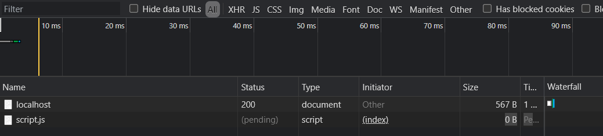

프로젝트를 시작하기에 앞서 "꼭 필요한 순간이 오기 전까지는 무작정 라이브러리를 도입하지 말자"고 뜻을 모았다. 서버 개발은 처음이다보니 지나치게 라이브러리에 의존하기 보다는 각각의 작동원리를 보다 정확하게 알고 넘어가길 희망하는 차원에서 정한 규칙이었다.

Express 프레임워크도 마찬가지다. Node.js에서 거의 필수적으로 그리고 가장 대중적으로 사용되는 만큼, Express의 장점은 수도 없을 테지만 필요한 순간이 오기 전까지는 일단 Node.js의 내장 모듈만을 사용하고 있었다. 

변화의 시점은 생각보다 빨리 찾아왔다. 프로젝트의 view 를 구성하는 HTML, CSS, JS 파일들 즉, ```정적 파일```을 serving 하는 데 있어서 Express의 도움 없이는 그 과정이 너무나 불편했기 때문이다.


#### 외부 모듈 없이 정적 파일 제공하기

로컬 포트 3000번에 프로젝트의 서버를 열었다고 가정했을 때, 해당 경로로 GET 요청을 보내면 메인 페이지의 HTML 파일이 서빙되어야 한다.

```main.html```이 메인 페이지에 해당되는 html 파일이고 내부에서 \<script> 태그를 사용하여 메인 페이지의 자바스크립트 파일인 ```script.js```를 참조하고 있다고 가정한다면, 서버가 위치한 ```server.js```의 코드는 다음과 같을 것이다. (js 파일은 public 디렉토리에 위치한 상태)

```javascript
const http = require('http');
const fs = require('fs');
const app = http.createServer((req, res) =>{
    if(req.url === '/') {
        fs.readFile('./main.html', (err, data) => {
            res.writeHead(200, {
                "Content-Type": "text/html"
            });
            res.end(data);
        });
    }
}).listen(3000);
```

지정된 경로로 GET 요청을 보내면, 브라우저는 main.html을 렌더링하여 화면에 출력한다. 동시에 페이지를 로드하는 데 오류가 발생한다.

오류의 원인을 찾기 위해 개발자 도구 - Network 탭을 확인해보니, ```script.js``` 파일에 대한 요청이 pending 상태에 멈춰있음을 알 수 있었다.




즉, 이를 통해서 우리는 브라우저가 ```main.html``` 파일 내부에 \<script> 태그로 참조하고 있는 ```script.js``` 파일을 자동으로 함께 요청하고 있음을 알 수 있었다. 이는 ```main.html``` 파일을 서빙할 때 ```script.js```가 함께 서빙되는 것이 아니라, 해당 파일을 서빙해 줄 별개의 처리가 필요하다는 것을 뜻한다. 따라서 public 디렉토리에 위치한 메인 페이지의 자바스크립트 파일을 서빙하기 위해서는 ```server.js```에서 '/script.js'라는 주소에 대해서도 추가적인 처리가 필요하다.

```javascript
const http = require('http');
const fs = require('fs');
const app = http.createServer((req, res) =>{
    if(req.url === '/') {
        fs.readFile('./main.html', (err, data) => {
            res.writeHead(200, {
                "Content-Type": "text/html"
            });
            res.end(data);
        });
    }
    // script.js 파일 서빙
    if(req.url === '/script.js') {
        fs.readFile('./public/script.js', (err, data) => {
            res.writeHead(200, {
                "Content-Type": "text/javascript"
            });
            res.end(data);
        });
    }
}).listen(3000);
```

이제 localhost:3000에 접속하면, 의도한 대로 ```main.html```과 함께 ```script.js```가 서빙되는 것을 확인할 수 있다. 브라우저가 제공된 ```main.html```을 파싱하며 ```script.js``` 파일 참조를 발견하면, localhost:3000/script.js 로 요청을 보내고, ```script.js```를 제공하는 응답이 성공적으로 처리되었기 때문이다.

따라서 위와 같은 방식을 사용한 프로젝트의 규모가 커지게 된다면, 매 요청마다 HTML 파일, JS 파일, 그리고 CSS 파일이나 이미지 파일까지 일일이 주소와 연결하여 응답처리를 해줘야 하는 불편함이 생긴다.


#### 외부 모듈을 사용한 정적 파일 제공

이처럼 모듈을 사용하지 않고 Node.js만으로 정적 파일을 한 번에 제공하기 위해서는 각 파일의 주소에 대한 처리를 개별적으로 해야 하기 때문에 코드의 양이 지나치게 많아지고 복잡해집니다. 

따라서 보다 쉽게 정적 파일을 제공하는 것을 도와주는 커스텀 모듈들이 존재한다.

**[node-static](https://www.npmjs.com/package/node-static)** 또는 **[serve-static](https://www.npmjs.com/package/serve-static)** 같은 모듈을 npm 레지스트리를 통해 설치하여 사용하면 된다. ```node-static```을 사용하여 정적 파일을 서빙하는 방법은 다음과 같다.

```javascript
const http = require('http');
const static = require('node-static');
const fileServer = new static.Server('./public');
const fs = require('fs');
const app = http.createServer((req, res) =>{
    if(req.url === '/') {
        fs.readFile('./public/main.html', (err, data) => {
            res.writeHead(200, {
                "Content-Type": "text/html"
            });
            res.end(data);
        });
    }
	req.addListener('end', function () {
        fileServer.serve(req, res);
    }).resume();
}).listen(3000);
```

node-static은 ```new static.Server('./public')```을 통해 public 디렉토리에 위치한 정적 파일을 서빙하는 서버 인스턴스를 생성한다. 그리고 생성된 서버 인스턴스에 ```.serve()``` 메서드를 호출하여 HTTP 요청과 응답 객체를 전달한다.


이제 모든 정적 파일의 주소에 대하여 일일이 응답 처리를 해줄 필요 없이 정적 파일을 제공할 수 있다.


#### Express의 정적 파일 제공

외부 모듈을 설치하고 호출하여 훨씬 간단하게 정적 파일을 서빙할 수 있었다. 그러나 여전히 모듈을 설치해야 하고, 그에 맞는 메서드의 정확한 사용이 필요하다.

Express 프레임워크를 사용하면 더욱 간단하게 정적 파일을 제공할 수 있다. Express에 내장된 ```express.static``` 미들웨어 함수를 사용하면, 지정한 디렉토리에 위치한 모든 정적 파일을 알아서 대신 검색하여 제공하기 때문이다.

```server.js```에서 다음과 같이 static 미들웨어 함수를 호출한다.

```javascript
const express = require('express');
const app = express();

app.use(express.static('public'));

app.get('/', (req, res) => {
        fs.readFile('./main.html', (err, data) => {
            res.writeHead(200, {
                "Content-Type": "text/html"
            });
            res.end(data);
        }
});
```

이처럼 Express 프레임워크를 사용하면, 추가적인 모듈 설치 없이도 정적 파일을 제공할 수 있다. 

게다가 Express는 정적 파일 제공뿐만이 아니라, 라우팅에 있어서도 쉽고 깔끔하게 라우터를 분리하여 코드를 더 효율적으로 관리할 수 있는 등 점점 코드의 규모가 늘어나는 프로젝트의 유지 보수에도 훨씬 이점이 많아보였다.
