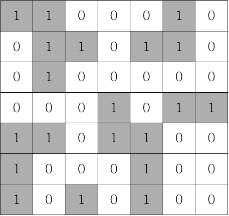

### 문제

바다에 섬이 총 몇 개인지 구하는 문제.  
육지는 1로 표시되고, 바다는 0으로 표시된다.




#### 문제 풀이 과정

**[1] DFS 풀이 (재귀)**

1. 격자판을 순회하며 섬이 있는 좌표를 찾는다 => 이중 for 문
2. 최초의 섬 좌표를 찾으면, 해당 좌표를 체크하고 연결된 섬 찾기를 시작한다 => 해당 좌표의 값이 1이면, 해당 좌표의 값을 0으로 바꾼 뒤, DFS 시작
3. 해당 좌표의 상하좌우대각선, 총 8개의 좌표를 순차적으로 탐색하며 섬을 찾는다 => 탐색 대상 좌표(nx,ny)는 현재 좌표(x,y)에서 시계방향으로 dx, dy 배열에 담긴 값만큼 각각 x, y 좌표에 더한다.
   (단, 유효한 좌표 값의 범위는 0 이상 N 미만이다)
4. 해당 섬에 연결된 모든 좌표를 찾아서 체크 했다면, 정답에 1을 더하고 다시 1번으로 돌아가 또 다른 섬 찾기를 반복한다.
5. 모든 섬을 찾아 지도의 모든 좌표 값이 0이 되었다면 끝.

```javascript
function solution(board){  
    let answer = 0;
    let n = board.length;
    let dx = [-1,-1,0,1,1,1,0,-1];
    let dy = [0,1,1,1,0,-1,-1,-1];

    function DFS(x, y) {
        board[x][y] = 0;
        for(let i=0; i<8; i++){
            let nx = x + dx[i];
            let ny = y + dy[i];
            if(nx>=0 && nx<n && ny>=0 && ny<n && board[nx][ny]===1) {
                DFS(nx, ny);
            }
            
        }
    }

    for(let i=0; i<n; i++) {
        for(let j=0; j<n; j++){
            if(board[i][j]===1) {
                    DFS(i, j);
                    answer++;
            }
        }
    }           
    return answer;
}

let arr=[[1, 1, 0, 0, 0, 1, 0], 
         [0, 1, 1, 0, 1, 1, 0],
         [0, 1, 0, 0, 0, 0, 0],
         [0, 0, 0, 1, 0, 1, 1],
         [1, 1, 0, 1, 1, 0, 0],
         [1, 0, 0, 0, 1, 0, 0],
         [1, 0, 1, 0, 1, 0, 0]];
console.log(solution(arr));
```

6. 특이사항

-방문한 좌표를 체크하기 위해 따로 체크 배열을 만들어줄 필요가 없었다. board를 바로 0으로 수정하면 해결될 일이었다.  
-섬의 최초 좌표부터 0으로 바꿔줘야 하기 때문에, ```board[x][y]=0```를 먼저 수행하고 좌표 탐색을 시작한다.  
-```answer++```의 위치는 최초 섬 좌표를 발견했을 때 or 해당 섬의 모든 좌표를 0으로 바꾼 이후 둘 다 가능했다.


**[2] BFS 풀이 (Queue)**  
큰 흐름은 DFS 풀이와 비슷했다.

1. 격자판을 순회하며 섬이 있는 좌표를 찾는다 => 이중 for 문
2. 섬 좌표를 찾으면, 해당 좌표를 체크하고 해당 좌표의 상하좌우대각선을 탐색하며 연결되어 있는 섬을 찾는다 => 최초 좌표를 queue에서 빼면서, 연결된 좌표들을 모두 queue에 넣는다.
3. 더 이상 연결된 섬이 없을 때까지 2번을 반복한다 => queue.length가 0이 될 때까지 반복
4. queue가 비었다면 정답에 1을 더하고 1번으로 돌아가 섬 찾기를 반복한다.

```javascript
function solution(board){  
    let answer = 0;
    let n = board.length;
    let dx = [-1,-1,0,1,1,1,0,-1];
    let dy = [0,1,1,1,0,-1,-1,-1];
    let queue = [];
    
    for(let i=0; i<n; i++) {
        for(let j=0; j<n; j++) {
            if(board[i][j] === 1) {
                board[i][j]=0;
                queue.push([i, j]);
                while(queue.length) {
                    let [x, y]=queue.shift();
                    for(let k=0; k<8; k++) {
                        let nx = x + dx[k];
                        let ny = y + dy[k];
                        if(nx>=0 && nx<n && ny>=0 && ny<n && board[nx][ny]===1) {
                            board[nx][ny] = 0;
                            queue.push([nx, ny]);
                        }
                    }
                }
                answer++;
            }
        }
    }
    return answer;
}

let arr=[[1, 1, 0, 0, 0, 1, 0], 
         [0, 1, 1, 0, 1, 1, 0],
         [0, 1, 0, 0, 0, 0, 0],
         [0, 0, 0, 1, 0, 1, 1],
         [1, 1, 0, 1, 1, 0, 0],
         [1, 0, 0, 0, 1, 0, 0],
         [1, 0, 1, 0, 1, 0, 0]];
console.log(solution(arr));
```

5. 특이사항

-DFS와 마찬가지로 ```answer++```의 위치는 탐색 전, 후 둘 다 가능  
-방문한 좌표 체크는 **꼭! Queue에 넣기 전에 해야한다!!** 뺄 때 체크를 하면 인접한 좌표가 중복체크 되기 때문이다.