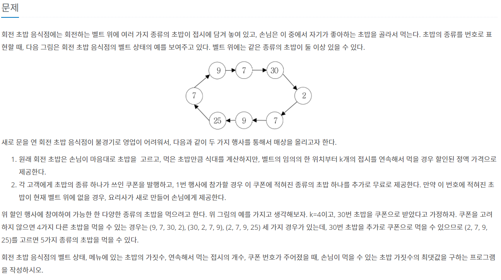
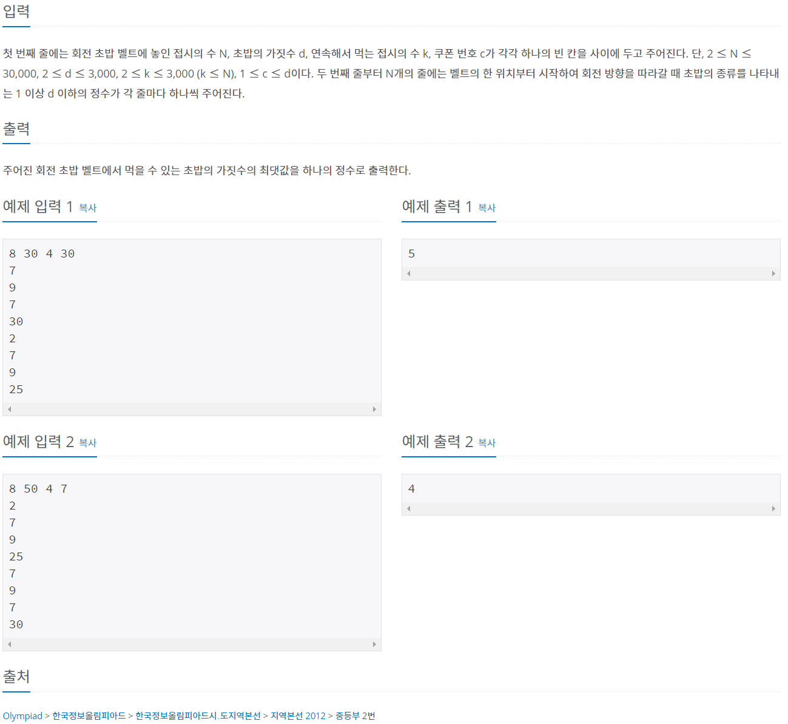

[BOJ 2531번 회전 초밥](https://www.acmicpc.net/problem/2531) JavaScript 풀이




)


#### 풀이

매번 k개라는 '일정한 개수'의 초밥 가짓수를 구해야 하기 때문에 **슬라이딩 윈도우**방법을 사용한다.

벨트는 원형이기 때문에 이를 배열로 나타낼  때, 배열의 앞에서부터 (k-1)번 째 요소를 배열의 뒤에 추가해야 한다.

먹은 초밥의 종류를 체크하기 위한 체크 배열이 필요하다.

쿠폰에 적혀진 종류의 초밥은 이미 먹은 것으로 체크하고 시작한다.

**진행 흐름:**

**[1]** sushi 배열의 첫 번째 요소부터 k-1 번째 요소를 배열의 뒤에 추가한다.

**[2]** check 배열을 생성하고 c초밥은 하나 먹은 것으로 체크한다.

**[3]** c초밥을 하나 먹은 상태로 시작하기 때문에 kind는 1부터 시작한다.

**[4]** 최초 k개의 초밥을 먼저 확인한다 (슬라이딩 윈도우). 처음 먹는 종류 즉, check 배열의 값이 0인 경우만 kind를 1 증가시킨다. 그렇지 않은 경우 check 배열의 값만 증가시킨다.

**[5]** 최초 k개 초밥의 가짓수를 max 변수에 담는다.

**[6]** k+1 번째 초밥부터 슬라이딩 윈도우 방법을 사용한다.

+ 체크 배열에서 가장 앞의 초밥(현재 인덱스-k)의 체크 배열 값을 1 감소시킨다. 해당 값이 0이면 한 번만 먹은 초밥 종류였다는 의미이므로 kind도 1 감소시킨다.
+ 새로운 초밥의 체크 배열 값을 1 증가시킨다. 해당 값이 1이고, 쿠폰 초밥의 종류가 아니라면 처음 먹는 초밥 종류라는 의미이므로 kind를 1 증가시킨다.

**[7]** 새로운 kind와 max를 비교하여 가짓수의 최댓값을 갱신한다.


### 코드

```javascript
const input = require("fs").readFileSync("/dev/stdin").toString().split("\n");
const [n, d, k, c] = input[0].split(" ").map(e=>parseInt(e));
let sushi = [];
for(let i=1; i<=n; i++) {
    sushi.push(parseInt(input[i]));
}
// [1]
for(let i=0; i<k-1; i++) {
    sushi.push(sushir[i]);
}
// [2]
let check = Array.from({length:d+1}, ()=>0);
check[c] = 1;
// [3]
let kind = 1;
// [4]
for(let i=0; i<k; i++) {
    if(check[sushi[i]] === 0) {
        check[sushi[i]] = 1;
        kind++;
    } else {
        check[sushi[i]]++;
    }
}
// [5]
let max = kind;
// [6]
for(let i=k; i<arr.length; i++) {
    check[arr[i-k]]--;
    if(check[arr[i-k]] === 0) kind--;
    check[arr[i]]++;
    if(check[arr[i]] === 1 && check[arr[i]] !== c) kind++;
    // [7]
    max = Math.max(max, kind);
}  

console.log(max);
```

이 코드는 메모리 11252KB, 시간 200ms 로 통과된다.

풀이에서 잘못된 부분이 있거나, 더 좋은 풀이가 있다면 적극적으로 제보 부탁드립니다!