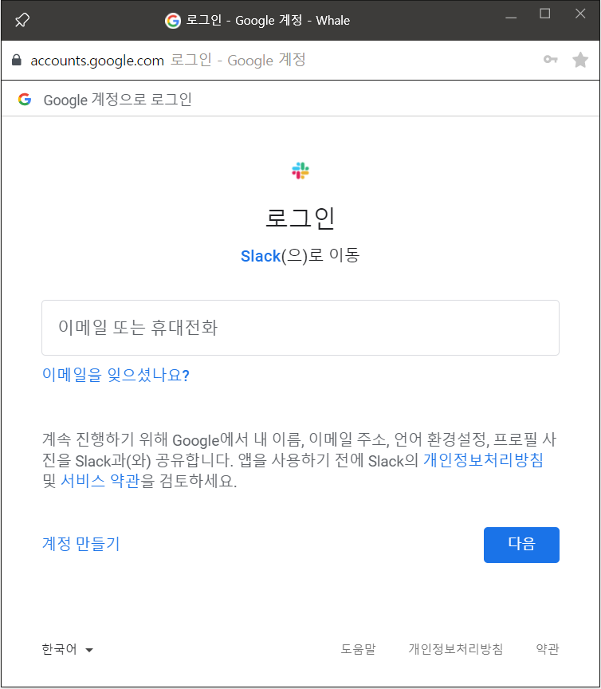

```OAuth 2.0```은 웹, 모바일 등의 애플리케이션 API 접근에 대한 사용자 인증을 허가하는 프로토콜이다. 사용자의 권한을 위임받은 한 서비스가 제 3의 서비스에서 사용자와 관련된 API를 활용할 수 있도록 만들어주는 '대리 인증 방식'이라고도 할 수 있을 것 같다. 쇼핑몰 사이트에서의 네이버 계정으로 로그인하기를 떠올리면 된다. ```passport.js```는 OAuth 2.0을 쉽게 활용할 수 있도록 도와주는 ```OAuth 2.0 Strategy```를 제공한다.


#### OAuth 2.0

OAuth 2.0에는 3자 간의 소통을 필요로 한다. 서비스를 사용하려는 User를 지칭하는 ```Resource Owner```, 사용자 관련 정보 즉, API를 제공하는 제3의 애플리케이션을 지칭하는 ```Resource Server```, 그리고 사용자가 이용하고자 하는 본래의 서비스인 ```Client``` 간의 상호작용이 일어난다. 이 글에서는 편의상 RO, RS, Client 라고 지칭한다.

> 사실 엄밀하게 따지면 Resource Server와 Authorization Server가 구분된다. 총 4자 간의 소통?

OAuth 2.0의 진행은 크게 3단계로 구분할 수 있다.

1. client와 RO 간의 인증 요청과 허가
2. client와 RS 간의 인증 요청과 허가
3. client와 RS 간의 정보 요청과 제공


#### Google 계정으로 로그인하기

'**철수**가 **B쇼핑몰**에서 **Google 계정으로 로그인하기**' 기능을 사용하기 위해서는 어떤 과정을 거쳐야 하는지 OAuth 2.0 진행흐름을 정리해본다.


**0. Client 등록**

모든 진행 과정에 앞서, B쇼핑몰은는 Google의 API를 이용하려면 **자격(Credential)**을 얻어야 한다. 자격은 **등록**이라는 과정을 거쳐서 얻을 수 있다. 이를 위해 B쇼핑몰은 ```Google 클라우드 플랫폼```에서 쇼핑몰 정보를 등록하여 OAuth 2.0을 사용하기 위한 자격을 얻어야 한다. 성공적으로 등록되면, Google은 쇼핑몰에 OAuth 2.0 ```클라이언트 ID, 클라이언트 SECRET```이라는 Credential을 발급한다. 

>  **Redirect URI**
>
> **등록** 과정에서 쇼핑몰이 구글에 제공해야 하는 정보 중에 Redirect URI이라는 것이 있다. 추후에 사용자가 구글에게 '나는 B쇼핑몰에 정보 제공하는 것을 동의하겠다'라고 말하면 구글은 그 허가 내용을 담은 코드(Authorization Code)를 발급하게 되는데, 쇼핑몰은 이 코드를 사용하여 구글에게 사용자A의 정보를 요청할 수 있게 되는 것이다. 따라서 구글이 발급하는 코드를 전달받을 주소가 필요한데, 그 주소가 Redirect URI인 것이다. 이 글에서는 Redirect URI을 **http://bshop.com/auth/google/callback**라고 가정한다.
>
> 이제 Google은 B쇼핑몰의 client ID, client Secret, Redirect URI 등의 정보를 보유하게 되었다.


**1. client와 RO 간의 인증 요청과 허가**

등록을 마치면, 비로소 첫 번째 단계로 진입한다. 

첫 번째 단계는 **철수-B쇼핑몰** 간에 동의를 구하는 과정이라고 할 수 있다. B쇼핑몰은 철수에게, 자신들이 철수의 Google 정보 중에서 어떤 것들을 활용할 것인지(**```scope```**), Google의 어떤 기능을 이용할 것인지를 알려주고 이러한 사실에 대해서 철수에게 동의를 구해야 한다. 이를 위해서 B쇼핑몰은 'Google 계정으로 로그인하기' 버튼 클릭 시, Google의 ```Authorization Server```로 사용자를 보내줘야한다. 철수가 B쇼핑몰의 로그인 페이지에서 'Google 계정으로 로그인하기' 버튼을 클릭했을 때 뜨는 아래의 화면이 바로 이 과정이다.


*(Google에게 이름, 이메일 주소, 언어 환경설정, 프로필 사진을 공유하는 것에 대해 동의를 구하는 페이지)*

철수가 B쇼핑몰이 자신의 어떠어떠한 Google 계정 정보를 취할 것이며, Google에서 어떤 기능을 사용할 것인지에 대해서 확인하여 동의하기 버튼을 누르면, Google은 이러한 동의 내용을 담은 ```Authorization Code```를 발급한다. 동시에 Google은 위에서 설명했던 redirect uri로 철수와 Authorization Code를 함께 보내주게 된다. 이 과정을 통해  철수는 B쇼핑몰이 아닌 Google에게 본인 인증을 한 것이고, B쇼핑몰은 Google이 철수를 인증했다는 사실을 전달받는 것이다. 따라서 B쇼핑몰은 철수를 직접적으로 인증할 필요도, 철수의 민감한 개인정보를 직접 관리할 필요도 없어지는 것이다.

이렇게 B쇼핑몰은 철수에게 철수의 Google 계정 정보 중 특정한 내용들(scope)을 자신들이 활용하겠다는 동의를 얻었고, 그 증거로서 Authorization Code까지 획득하게 된 것이다.


**2. client와 RS 간의 인증 요청과 허가**

이제 B쇼핑몰은 철수의 동의를 얻었다는 사실을 Google에게 증명하여, 실제 철수의 정보를 얻기위한 자격을 얻어내야 한다. 그 자격이 바로 ```Access Token```이다. 이번 단계는 B쇼핑몰이 Google의 Authorization Server에 Access Token을 요청하는 과정인 것이다.

B쇼핑몰이 Google Authorizaion Server에 Access Token을 요청하면, Google 서버는 B쇼핑몰의 client ID, client Secret, redirect URI 그리고 조금 전 단계에서 발급한 Authorization Code 등이 유효한지 검증한다. 이 검증을 통과하면 Google은 B쇼핑몰에 비로소 Access Token(그리고 Refresh Token이라는 것도)을 발행한다. 이때, Access Token은 redirect uri의 query string에 담겨서 B쇼핑몰에 전달된다. 이 토큰에는 "Google 계정을 사용하는 철수가 자신의 특정 정보를 Google로부터 client ID를 발급받은 B쇼핑몰에게 제공하는 허용했다"는 의미가 담긴 것으로 생각하자.

이로써 B쇼핑몰은 Google에게 철수의 정보를 요청할 수 있는 자격까지 얻었다. 이제 남은 것은 B쇼핑몰이 발급받은 토큰을 사용하여 Google로부터 철수의 정보를 얻는 과정뿐이다.


**3. client와 RS 간의 정보 요청과 제공**

B쇼핑몰은 Google의 Authorization Server로부터 발급받은 Access Token을 가지고 이제는 Google의 Resource Server에 철수의 정보를 요청해야 한다.

이제 Google이 정해놓은 API 사용을 위한 요청 방식에 맞게 Access Token을 전송하면, Google은 scope를 통해 사용하기로 약속한 철수의 정보들을 B쇼핑몰에 응답해주는 것이다.


#### 참고

+ [The OAuth 2.0 Authorization Framework](https://datatracker.ietf.org/doc/html/rfc6749#section-1.3.1)
+ [Passport Documentation](http://www.passportjs.org/docs/oauth/)

+ [Opentutorials.org](https://www.opentutorials.org/course/3413)

